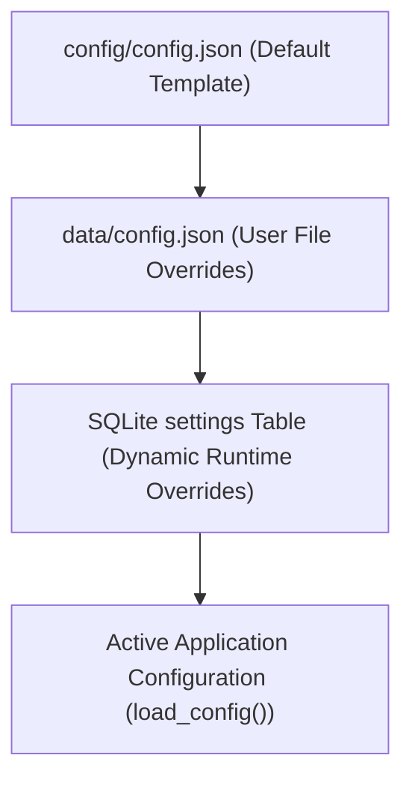

# Settings & Configuration Guide

This guide documents the settings and configuration architecture of the Portfolio Manager, detailing the dynamic settings editable via the GUI and REST API versus static server configuration.

Base repository: [https://github.com/SkyStrike/portfolio-manager/](https://github.com/SkyStrike/portfolio-manager/)

---

## 1. Architecture & Loading Hierarchy

Configuration is resolved at runtime using a layered precedence model:



1. **SQLite `settings` Table (Highest Priority)**:
   - Dynamic key-value pairs stored in the database.
   - Keys use dot-notation (e.g. `sorting.classification_priority`, `cron.metrics_run_hour`) to override specific configuration branches.
   - Updated immediately via the Control Center GUI or `POST /api/settings`.
2. **`data/config.json`**:
   - Custom file overrides placed in the persistent `data/` volume.
3. **`config/config.json` (Base Fallback)**:
   - Default configuration shipped with the application container.

---

## 2. Actively Editable Settings (GUI & REST API)

These **4 operational settings** are dynamically managed through the SQLite database, editable in the Control Center Settings panel, and modified via `POST /api/settings`:

### 2.1 `sorting.classification_priority`
* **Type**: `list[str]`
* **Default**: `[]` (Fallback: `["Core ETF", "Growth", "Income / Div", "Speculative", "Cash"]`)
* **GUI Location**: Control Center $\rightarrow$ Settings $\rightarrow$ Classification Priority
* **Usage**: Controls the display order of asset classification groups across the SPA dashboard, classification allocation charts, and performance breakdown tables.
* **Example Payload**:
  ```json
  {
    "sorting.classification_priority": ["Core ETF", "Growth", "Income", "Speculative", "Cash"]
  }
  ```

---

### 2.2 `external_services.options_tracker_url`
* **Type**: `str`
* **Default**: `""` (Fallback: `"http://yui.home/options-tracker/api/positions"`)
* **GUI Location**: Control Center $\rightarrow$ Settings $\rightarrow$ Options Tracker URL
* **Usage**: The REST endpoint queried during dashboard cache builds to pull live open options contracts, strategy legs, and portfolio cash assignment risk metrics.
* **Example Payload**:
  ```json
  {
    "external_services.options_tracker_url": "http://yui.home/options-tracker/api/positions"
  }
  ```

---

### 2.3 `external_services.backtester_url`
* **Type**: `str`
* **Default**: `""` (Fallback: `"http://yui.home/backtester/"`)
* **GUI Location**: Control Center $\rightarrow$ Settings $\rightarrow$ Backtester URL
* **Usage**: Base URL used to generate deep-links on asset cards, allowing one-click backtesting of portfolio holdings on an external backtester service.
* **Example Payload**:
  ```json
  {
    "external_services.backtester_url": "http://yui.home/backtester/"
  }
  ```

---

### 2.4 `cron.metrics_run_hour`
* **Type**: `int` (`0`–`23`)
* **Default**: `6` (6:00 AM SGT)
* **GUI Location**: Control Center $\rightarrow$ Settings $\rightarrow$ Daily Metrics Run Hour
* **Usage**: Configures the scheduled hour (in Singapore Time / SGT, UTC+8) when the background worker runs the automated daily price fetch, dividend sync, and closing metrics snapshot.
* **Example Payload**:
  ```json
  {
    "cron.metrics_run_hour": 6
  }
  ```

---

## 3. Static Server Configurations (Not Edited via API)

The remaining sections in `config/config.json` define static filesystem paths or server startup parameters that are not driven by dynamic runtime API updates:

| Section / Key | Type | Default | Purpose & Notes |
| :--- | :--- | :--- | :--- |
| **`allowed_documents`** | `dict[str, str]` | `{"stock-options": "data/stock-options.json", "ib-data": "data/ib_data.json"}` | Maps allowed upload identifiers to physical storage paths on disk for `POST /api/upload`. |
| **`finance.max_workers`** | `int` | `30` | Maximum thread pool worker count for parallel `yfinance` background pricing queries. |
| **`finance.conversion_rates`** | `dict[str, float]` | `{"USD": 1.2754, "CAD": 0.9327, "SGD": 1.0}` | **Legacy / Fallback**: Superseded by live FX rates dynamically stored and updated in the `fx_rates` database table. |
| **`brokers`** | `list[str]` | `["IBKR", "MOOMOO", "SRS (DBS)"]` | Initial baseline broker list; active broker mappings are dynamically derived from database portfolios and cash reports. |
| **`ui.*`** | `dict` | Layout widths & colors | **Legacy Artifact**: Replaced by CSS variables and Vue 3 reactive theme styling in `static/css/style.css`. |

---

## 4. REST API Reference

### 4.1 Get Application Settings
```http
GET /api/settings
```
Returns the full resolved configuration object merging file defaults and database overrides.

#### Response Example (`200 OK`):
```json
{
  "brokers": ["IBKR", "MOOMOO", "SRS (DBS)"],
  "finance": {
    "max_workers": 30,
    "conversion_rates": { "USD": 1.2754, "CAD": 0.9327, "SGD": 1.0 }
  },
  "external_services": {
    "options_tracker_url": "http://yui.home/options-tracker/api/positions",
    "backtester_url": "http://yui.home/backtester/"
  },
  "sorting": {
    "classification_priority": ["Core ETF", "Growth", "Income"]
  },
  "cron": {
    "metrics_run_hour": 6
  }
}
```

---

### 4.2 Update Settings
```http
POST /api/settings
Content-Type: application/json
```
Persists one or more setting overrides into the SQLite `settings` table using dot-notation keys, and synchronously rebuilds the dashboard cache.

#### Request Body Example:
```json
{
  "sorting.classification_priority": ["Core ETF", "Growth", "Income", "Speculative", "Cash"],
  "external_services.options_tracker_url": "http://yui.home/options-tracker/api/positions",
  "external_services.backtester_url": "http://yui.home/backtester/",
  "cron.metrics_run_hour": 6
}
```

#### cURL Example:
```bash
curl -X POST "http://localhost:8080/api/settings" \
  -H "Content-Type: application/json" \
  -d '{
    "sorting.classification_priority": ["Core ETF", "Growth", "Income", "Speculative", "Cash"],
    "cron.metrics_run_hour": 6
  }'
```

#### Response Example (`200 OK`):
```json
{
  "status": "success",
  "message": null
}
```
