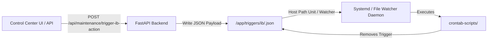

# External Systemd & File-Watcher Trigger Guide

This document describes the external file-watcher trigger architecture that allows the Portfolio Manager web container to safely request external shell script execution (such as downloading IBKR report data or generating dividend flex reports) via systemd `.path` units or background file watchers.

---

## 1. Overview & Architecture

To keep the web container secure and decoupled from host-level cron/system privileges, trigger requests are written to watched JSON files inside `/app/triggers/ib/` (mounted to `./triggers/ib` on the host).



---

## 2. Trigger Directory & Payload Specs

* **Watched Directory**: `/app/triggers/ib/`
* **Git Tracking**: Ignored via `.gitignore` (`triggers/`)
* **Volume Mount**: `./triggers:/app/triggers` in `docker-compose.yml`

### Supported Actions & Payloads

#### Action 1: `download_data`
* **Trigger File**: `/app/triggers/ib/download_data.json`
* **Target Script**: `crontab-scripts/ib-report-downloader.sh`
* **Payload Structure**:
```json
{
  "action": "download_data",
  "created_at": "2026-08-01T10:49:00.123456"
}
```
* **Effect**: Regenerates `data/ib_data.json` to populate current cash balances and broker position stock quantities.

#### Action 2: `flex_dividend`
* **Trigger File**: `/app/triggers/ib/flex_dividend.json`
* **Target Script**: `crontab-scripts/process-ibkr-dividends.sh`
* **Payload Structure**:
```json
{
  "action": "flex_dividend",
  "created_at": "2026-08-01T10:49:00.123456"
}
```
* **Effect**: Fetches the 1-week moving window IBKR Flex Query dividend report and triggers automatic dividend ingestion into SQLite via `/api/dividends/import-ibkr`.

---

## 3. Pending Lock & Double-Run Protection

To prevent concurrent or duplicate script runs:
1. **File Existence Check**: If `/app/triggers/ib/<action>.json` already exists on disk, the backend rejects new POST requests with HTTP 400 (`Action is pending processing`).
2. **UI Button State**: The Maintenance tab queries `GET /api/maintenance/system-ib-status`. If a trigger file is present, the corresponding trigger button is disabled with a `⏳ Pending Processing...` label.
3. **Cleanup**: Once the external watcher script completes its run, it **must delete the trigger JSON file** (`rm -f /app/triggers/ib/<action>.json`), releasing the pending lock and re-enabling the button in the UI.

---

## 4. API Endpoints

### `POST /api/maintenance/trigger-ib-action`
Triggers a new external systemd action by creating its trigger JSON file.

**Request Body**:
```json
{
  "action": "download_data"
}
```

**Response (Success - 200)**:
```json
{
  "status": "success",
  "message": "Successfully created trigger file 'download_data.json' in '/app/triggers/ib'",
  "action": "download_data",
  "filepath": "/app/triggers/ib/download_data.json"
}
```

---

### `GET /api/maintenance/system-ib-status`
Returns the pending status of all system trigger files.

**Response (200)**:
```json
{
  "download_data_pending": false,
  "flex_dividend_pending": true
}
```

---

## 5. Sample Systemd Unit Configurations

Below are example systemd `.path` and `.service` unit configurations for your host environment:

### `ib-download-data.path`
```ini
[Unit]
Description=Watch for IBKR Download Data Trigger File

[Path]
PathChanged=/mnt/d/Documents Drive/Personal Documents/YK Programs/repos/automation/services/portfolio-manager/triggers/ib/download_data.json
Unit=ib-download-data.service

[Install]
WantedBy=multi-user.target
```

### `ib-download-data.service`
```ini
[Unit]
Description=Execute IBKR Data Download Script

[Service]
Type=oneshot
ExecStart=/bin/bash /mnt/d/Documents Drive/Personal Documents/YK Programs/repos/automation/services/portfolio-manager/crontab-scripts/ib-report-downloader.sh
ExecStartPost=/bin/rm -f /mnt/d/Documents Drive/Personal Documents/YK Programs/repos/automation/services/portfolio-manager/triggers/ib/download_data.json
```
